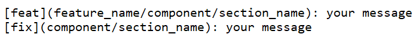

##Live link: https://appointify9.web.app

## React + Vite

This template provides a minimal setup to get React working in Vite with HMR and some ESLint rules.

Currently, two official plugins are available:

- [@vitejs/plugin-react](https://github.com/vitejs/vite-plugin-react/blob/main/packages/plugin-react/README.md) uses [Babel](https://babeljs.io/) for Fast Refresh
- [@vitejs/plugin-react-swc](https://github.com/vitejs/vite-plugin-react-swc) uses [SWC](https://swc.rs/) for Fast Refresh

### File Naming Structure

- If it's a two-syllable word then write like this
- Ex: HomePage, SignUp, AuthProvider, MainLayout, CustomerReview etc.

## Contributors, Please Be Advised and follow this rules strictly

- When starting to code first pull from the stage branch
- When pushing code first pull from the stage branch then push to your created branch (not stage, not main)
- Never pull from or push to main branch
- Developers will work with only the src directory
- Feature/Bugfix branches will be created from the main branch
- Please make the branch names simple and short (ex: feature/feature_name)

## Follow Branch & Commit rule

- After being satisfied with the changes, developers will create a PR to the stage branch and if there is no conflict they may add the PR and may delete the branch
- The lead will review code changes and merge/close the PR
- The lead will test the code and only he will add the code to the main branch
- Every single feature/bugfix branches will be deleted after a PR
- Only lead/Maintainer/operations-team will edit the primary README

## Branch and Commit Rule

Primary Branch Name:

- main
- stage (used as testing branch)

Secondary/Feature/bugfix branches:

- feature/feature_name
- bugfix/name

### Commit Message Rules

Please write messages this way -

### For those who want to run this project locally

You will need to add (.env.local) file in the root directory  
N.B. Before use replace the things with quotation and also remove the quotation

VITE_APIKEY="api-key_firebase"  
VITE_AUTHDOMAIN="auth-domain_firebase"  
VITE_PROJECTID="project-id_firebase"  
VITE_STORAGEBUCKET="storage-bucket_firebase"  
VITE_MESSAGINGSENDERID="messaging-sender-id_firebase"  
VITE_APPID="app-id_firebase"  
VITE_MEASUREMENTID="measurement-id_firebase"  
VITE_SERVER_URL="backend-url"  
VITE_EMAILJSSERVICEID="service_id_emailjs"  
VITE_EMAILJSTEMPLATEID="template_id_emailjs"  
VITE_EMAILJSPUBLICKEY="public-key_emailjs"  
